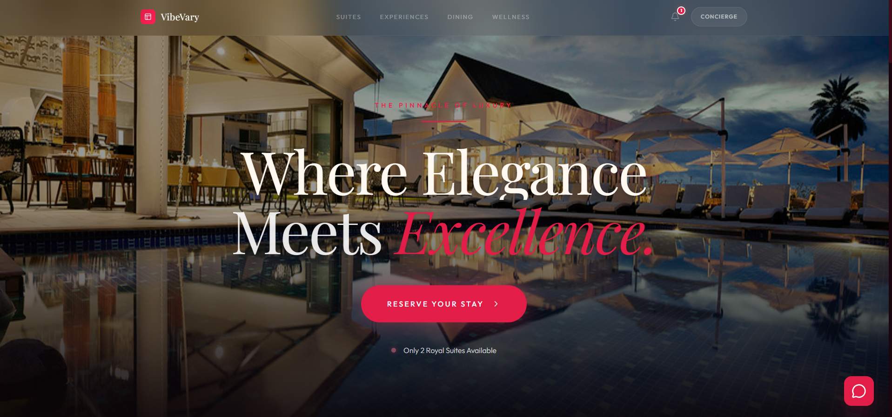
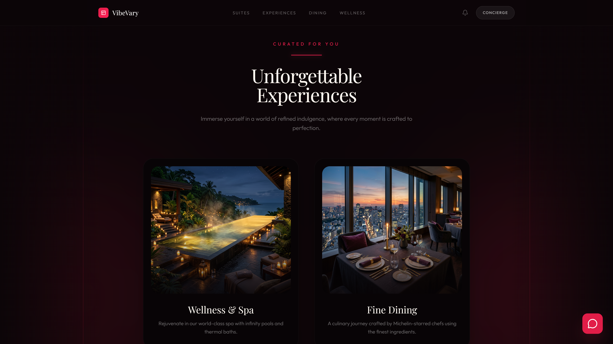
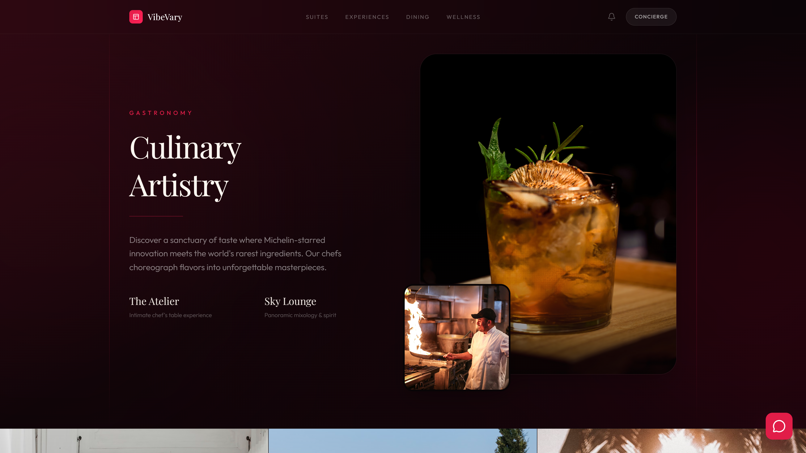
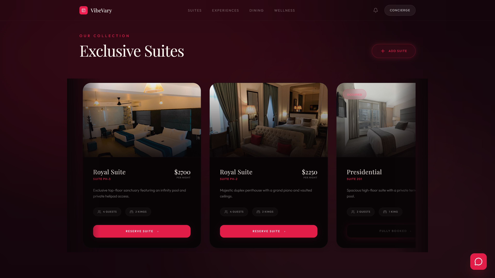
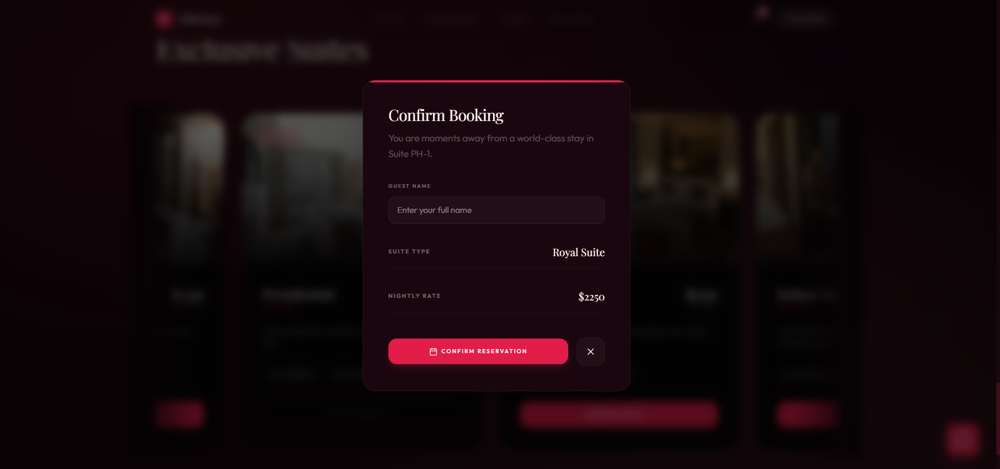
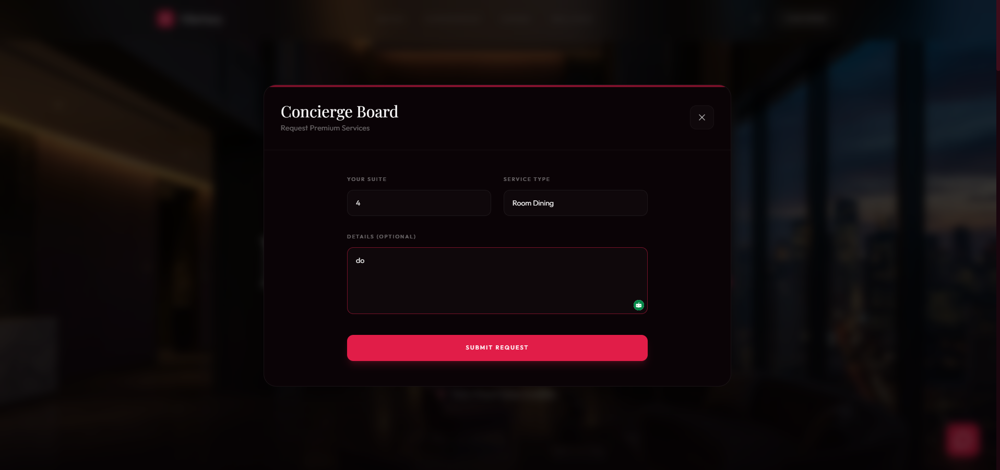
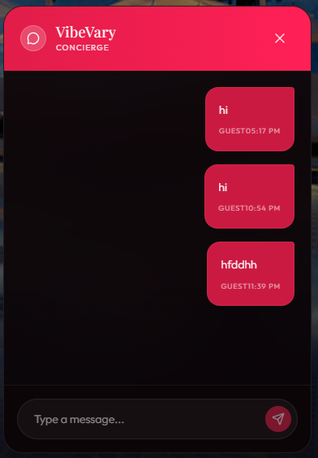
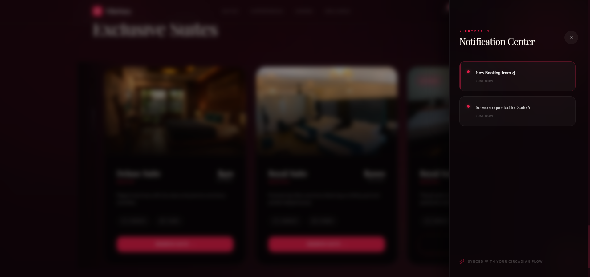

  
  
  
  
  
  
  
  

# 🧩 VibeVary | Cinematic Hotel Experience

> **Crafted for Excellence.**

VibeVary is a **premium, full-stack hotel room booking application** designed to **redefine the digital hospitality interface**.

The system focuses on **state-of-the-art cinematic animations and "Quiet Luxury" aesthetics** and aims to **provide an immersive, high-performance booking experience bridging the gap between digital interaction and physical luxury**.

---

# ✨ Key Features

| Feature | Description |
|---|---|
| **Infinite Suite Carousel** | A stunning, un-interrupted scrollable gallery showcasing exclusive suites with high-tension physics. |
| **Real-time Occupancy engine** | Live suite availability tracking preventing double-bookings using full-duplex WebSockets. |
| **Live Concierge Board** | An interactive request portal allowing guests to immediately order room dining or spa services. |
| **Interactive Notification Center** | A sophisticated lateral panel tracking live hotel events, bookings, and concierge updates. |
| **Dynamic Pricing Logic** | Automated nightly rate calculation based on suite capacity, live occupancy, and base thresholds. |
| **Embedded Synchronization** | Zero-setup local PouchDB document storage mimicking NoSQL data flow for rapid prototyping. |

---

# 🎬 Project Demonstration

The following resources demonstrate the system's behavior:

- [📸 Screenshots of key features](#-screenshots)
- [⚙️ Architecture Overview](#️-architecture-overview)
- [🧠 Engineering lessons](#-engineering-lessons)
- [🔧 Key Design decisions](#-key-design-decisions)
- [🗺️ Roadmap](#️-roadmap)
- [🚀 Future improvements](#-future-improvements)
- [📄 Documentation](#-documentations)
- [📝 License](#-license)
- [📩 Contact](#-contact)

If deeper technical access is required, it can be provided upon request.

---

# 📹 Product Video

> **[DEMONSTRATION PENDING]**

*A comprehensive video or GIF of the system's walkthrough demonstrating the Architecture, engines, and core workflows is available soon!*

---

# 📸 Screenshots

| 1. Hero Landing |
|---------------|
|  |

| 2. Experiences |
|---------------|
|  |

| 3. Fine Dining |
|---------------|
|  |

| 4. Wellness Retreat |
|---------------|
|  |

| 5. Exclusive Suites |
|---------------|
|  |

| 6. Booking Engine |
|---------------|
|  |

| 7. Concierge Board |
|---------------|
|  |

| 8. Global Chat Hub |
|---------------|
|  |

| 9. Notification Center |
|---------------|
|  |

---

# ⚙️ Architecture Overview

VibeVary is implemented using a **Decoupled Full-Stack Monorepo, modular, feature-based pattern (NestJS Modular Monolith + React Component-Based SPA)**.

### Frontend (`frontend/src/`)
- **React 18** (UI Library)
- **Vite** (Next-generation build tool)
- **Framer Motion + GSAP** (Physics-based animation)
- **Tailwind CSS** (Utility-first styling, Midnight/Rose palette)

### Backend (`backend/src/`)
- **NestJS** (Opinionated Node.js Framework)
- **TypeScript** (Strict type safety across the stack)
- **Socket.IO** (Real-time event gateway)
- **PouchDB** (Embedded local NoSQL database)
- **PostgreSQL** (Embedded relational database)

### Communication
- **RESTful Architecture** (Standard CRUD HTTP endpoints)
- **Full-Duplex WebSockets** (Low-latency bidirectional state synchronization)

### Local Persistence
- **Local File System Storage** (PouchDB `.pouchdb/` directory, mimicking CouchDB)
- **Environment Driven** (Configuration via `.env` files)

---

# 🧠 Engineering Lessons

During development of VibeVary the focus areas included:

- **Monorepo vs Multi-repo Structure**: Utilizing a decoupled full-stack approach within a single repository to ensure rapid development and feature synchronization without the overhead of heavy workspace managers.
- **Backend Architecture: NestJS Modular Monolith**: Enforcing strict Separation of Concerns and Feature-Based grouping to retain enterprise-grade maintainability while deferring the premature complexity of microservices.
- **Database: PouchDB (Temporary) -> PostgreSQL (Target)**: Prototyping rapidly with local embedded NoSQL, while designing a clear migration path to PostgreSQL to enforce ACID compliance for relational booking data.
- **Real-Time Concurrency: WebSocket Gateway**: Leveraging full-duplex Socket.IO communication to instantly push physical room state mutations to all clients, preventing traditional long-polling strain and double-booking errors.
- **Build Tools: Vite over Webpack or CRA**: Utilizing native ES modules for instantaneous Hot Module Replacement, a critical requirement for rapidly tuning complex, physics-based UI animations.

> **[Read the Full Engineering Decisions Document](docs/engineering_decisions.md)**

---

# 🔧 Key Design Decisions

1. **Frontend Architecture: React Component-Based SPA**
   The application is explicitly built as a fluid Single Page Application to avoid immersion-breaking DOM reloads. We utilize strict Role/Domain-Based folder structures (`components/home/` vs `components/ui/`) to prevent domain logic from leaking into highly reusable atomic UI elements.

2. **Aesthetic Concept: "Quiet Luxury"**
   The UI is dominated by deep Midnight Blacks (`#0a0306`) contrasted against vibrant Rose structural glows (`#E11D48`), actively rejecting clinical whites or corporate blues. A strict pairing of heritage serif headings and modern sans-serif UI elements ensures functional usability isn't sacrificed for this aesthetic.

3. **Motion & Micro-Interactions**
   Relying strictly on `framer-motion` and `GSAP`, the UI avoids standard linear CSS transitions in favor of high-tension springs (`damping: 25`, `stiffness: 200`). This ensures elements like the Notification Center lateral panel and Booking Modals do not just "fade in", but slide in with tangible physical mass, resulting in a premium, weighty response.

4. **The Infinite Suite Carousel**
   To prevent analysis paralysis, the "Exclusive Suites" section utilizes an infinite, high-tension dragging carousel rather than a passive vertical grid. By physically dragging the interface, the user actively participates in exploration, while depth scaling artificially generates 3D space.

> **[Read the Full Design Decisions Document](docs/design_decisions.md)**

---

# 🗺️ Roadmap

Key upcoming features planned for VibeVary:

- `[IN PROGRESS]` **PostgreSQL Integration** — Transitioning from PouchDB to a strict relational schema using Prisma/TypeORM for ACID compliance.
- `[NOT STARTED]` **Stripe Payment Gateway** — Integrating live credit card processing for confirmed suite reservations.
- `[NOT STARTED]` **Interactive Floor Plan** — A WebGL or SVG interactive map allowing users to select their physical room location.
- `[NOT STARTED]` **Admin Dashboard** — A dedicated CRM view for hotel staff to manage bookings and respond to concierge requests.
- `[NOT STARTED]` **Automated CI/CD** — Dockerizing the Monorepo and establishing automated GitHub Action deployments.

---

# 🚀 Future Improvements

Planned enhancements include:

- Transitioning to a global CDN for high-resolution static assets (Suite images).
- Implementing JWT Authentication for guest accounts and staff roles.
- Adding comprehensive end-to-end testing via Playwright.
- Expanding the Socket.IO gateway to support horizontal scaling using a Redis adapter.
- Native mobile application wrappers utilizing React Native for iOS/Android.

---

## 📄 Documentations

Additional documentation is available in the `docs/` folder:

| File | Description |
|---|---|
| ["Engineering Decisions"](docs/engineering_decisions.md) | Comprehensive rationale covering the Monolith structure, Database choices, and real-time syncing. |
| ["Design Decisions"](docs/design_decisions.md) | Comprehensive rationale covering the "Quiet Luxury" aesthetic, Typography, and React Component architecture. |

---

# 📝 License

This repository is published for **portfolio and educational review purposes**.

The source code may not be accessed, copied, modified, distributed, or used without explicit permission from the author.

© 2026 Viraj Tharindu — All Rights Reserved.

---

# 📩 Contact

If you are reviewing this project as part of a hiring process or are interested in the technical approach behind it, feel free to reach out.

I would be happy to discuss the architecture, design decisions, or provide a private walkthrough of the project.

**Opportunities for collaboration or professional roles are always welcome.**

📧 Email: [virajtharindu1997@gmail.com](mailto:virajtharindu1997@gmail.com)  
💼 LinkedIn: [viraj-tharindu](https://www.linkedin.com/in/viraj-tharindu/)  
🌐 Portfolio: [vjstyles.com](https://vjstyles.com)  
🐙 GitHub: [VirajTharindu](https://github.com/VirajTharindu)

---

  <em>Immerse yourself in digital luxury!!! ✨🥂🌃</em>

